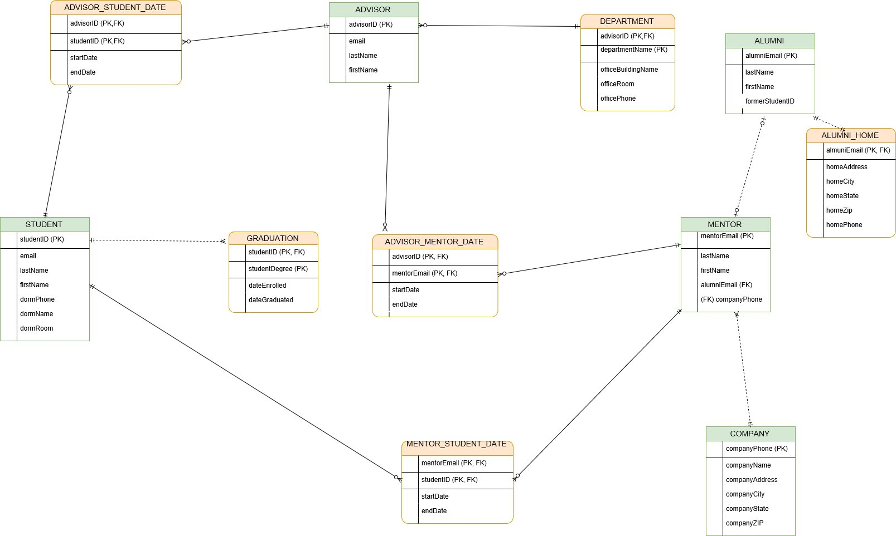

# University

## Context

One of the most important skills for a Database Administrator is to be able to translate ER Diagrams into code.

## The Assignment

You will be working with the provided ER diagram.

### Deliverables

+ A GitHub repository called `sql-capstone-project`.
+ Don’t forget to push your code to GitHub.

```sh
git add .
git commit -m "«your commit msg»"
git push origin master
```

### Sprint 1 | Relational Model



In a `sprint_1.sql` file, write SQL code to build the Relational Model provided.

### Sprint 2 | Save Information

Analize the provided *spreadsheet*, it contains all data that you will need to migrated to the new database. Make sure you add all records.

##### Advisor

|#|Email|Full Name|
|-|-----|---------|
|2001|John.Doe@hu.edu|John Doe|
|2002|Alice.Wonderland@hu.edu|Alice Wonderland|
|2003|Bob.Dylan@hu.edu|Bob Dylan|

##### Student

|#|Email|Full Name|DORM (Phone, Name, Room)|
|-|-----|---------|------------------------|
|2001|John.Bob@students.hu.edu|John Bob|516-555-5655, Whitman, 1|
|2002|Ryan.King@students.hu.edu|Ryan King|516-555-5655, Whitman, 1|
|2003|Michael.Shawn@students.hu.edu|Michael Shawn|516-555-5655, Whitman, 1|
|2004|Troy.Bell@students.hu.edu|Troy Bell|718-525-1615, Hale, 1|
|2005|Nickel.Sauce@students.hu.edu|Nickel Sauce|718-525-1615, Hale, 1|
|2006|Drake.Taco@students.hu.edu|Drake Taco|516-555-5655, Whitman, 1|

##### Alumni

|Email|Full Name|# Student|
|-----|---------|---------|
|Anthony.Jaghab@somewhere.com|Anthony Jaghab|1001|
|Jupraj.Singh@somewhere.com|Jupraj Singh|1002|
|Andre.King@somewhere.com|Andre King|1003|

##### Company

|Phone|Name|(Address, City, State, Zipcode)|
|-----|----|-------------------------------|
|516-111-1112|Richard Allen|400 Forest Ave,West Hempstead,NY,11552|
|516-111-1113|Coca Cola|321 Hamburger Ave,West Hempstead,NY,11552|
|516-111-1114|Pepsi|21 West Valley Ave,West Hempstead,NY,11552|

##### Mentor

|Email|Full Name|Alumni Email|Company Phone|
|-----|---------|------------|-------------|
|Andre.King@companyname.com|Andre King|Andre.King@somewhere.com|516-111-1112|
|Michael.Junior@companyname.com|Michael Junior|NULL|516-111-1114|
|Connor.Junior@companyname.com|Connor Junior|NULL|516-111-1113|

##### Advisor Student Date

|# Advisor|# Student|Start Date|End Date|
|---------|---------|----------|--------|
|2001|2002|1996-01-01|1998-01-01|
|2002|2001|2000-01-01|NULL|
|2003|2003|2000-01-01|NULL|

##### Advisor Mentor Date

|# Advisor|Mentor Email|Start Date|End Date|
|---------|------------|----------|--------|
|2001|Andre.King@companyname.com|1996-01-01|NULL|
|2002|Andre.King@companyname.com|2000-01-01|NULL|
|2003|Andre.King@companyname.com|2000-01-01|NULL|

##### Mentor Student Date

|Mentor Email|# Student|Start Date|End Date|
|------------|---------|----------|--------|
|Andre.King@companyname.com|2001|2000-01-01|NULL|
|Andre.King@companyname.com|2002|2001-01-01|NULL|
|Andre.King@companyname.com|2003|2002-01-01|NULL|

##### Alumni Home

|Alumni Email|Home (Address, City, State, Zipcode, Phone)|
|------------|-------------------------------------------|
|Anthony.Jaghab@somewhere.com|414 Hunt Place,West Hempstead,NY,11552,516-555-5551|
|Jupraj.Singh@somewhere.com|201 Valley Place,West Hempstead,NY,11552,516-555-5552|
|Andre.King@somewhere.com|204 Strong Place,West Hempstead,NY,11552,516-555-5553|

##### Graduation

|# Student|Degree|Enrolled (Date)|Graduated (Date)|
|---------|------|---------------|----------------|
|2001|B.A Arts|2000-01-01|NULL|
|2002|B.A Comp. Programming|2000-01-01|NULL|
|2003|B.A Media|2000-01-01|NULL|

##### Departments

|# Advisor|Name|Office (Building name, Room, Phone)|
|---------|----|-----------------------------------|
|2001|Art|Hale, 1, 631-444-5551|
|2002|Computer Systems|Hale, 1, 631-243-3552|
|2003|Art|Media, 1, 631-144-1533|

###### Write the SQL code in a `sprint_2.sql` file.

### Sprint 3 | Querying the Database

Gathering insights.

#### Questions

1. Show all students ordered by last name in ascendent way.
2. Write a query to list all the students living in the Whitman dorm.
3. Write a query to list the number of students assigned to each faculty advisor.
4. Write a query to list first name, last name, and email, and company name of the alumni working as a mentor in the university.

###### Write the SQL code in a `sprint_3.sql` file.

